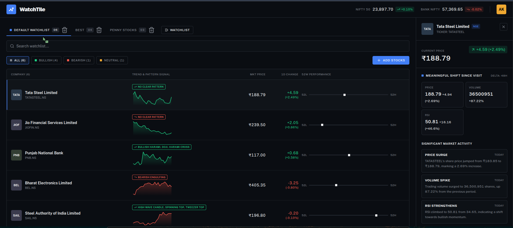

#  WatchTile

**An AI-Powered Smart Watchlist Platform for Modern Traders**

---

## 📌 Overview

**WatchTile** is an intelligent stock watchlist platform designed to bridge the gap between static stock trackers and actionable market insights. Instead of overwhelming users with raw ticker grids, WatchTile analyzes historical price action, volume spikes, and technical indicators to reason about market behavior. 

Powered by the **`openai/gpt-oss-20b`** model on Groq, WatchTile automatically detects and highlights **"Meaningful Shifts Since Your Last Visit"**, providing instant, human-readable explanations of price variations, P&L impact, and volume movements whenever you revisit a stock. Furthermore, it incorporates a deterministic technical analysis engine to automatically scan and predict classic Japanese candlestick patterns across multiple stocks in real time.

[Click here to view the live website](https://watchtile.vercel.app/)
>   The API server may occasionally go down because it is hosted on Render. 

---

## 📸 Screenshots

### 🎯 Main WatchTile Dashboard
*Custom watchlists, sentiment filtering, real-time candlestick pattern badges, and side-panel AI market shift insights.*

---

## ✨ Features

* 📁 **Customizable Watchlists:** Create, organize, rename, and manage multiple stock watchlists (e.g., Default Watchlist, Best, Penny Stocks) seamlessly.
* 🤖 **AI-Driven Shift Analysis:** Uses the **`openai/gpt-oss-20b`** model to compare your last session state with the current state, surfacing structured events under "Meaningful Shift Since Visit".
* 🕯️ **Algorithmic Candlestick Pattern Recognition:** Scans over 40 classic Japanese candlestick patterns (such as *Bullish Harami*, *Doji*, *Bearish Engulfing*, *Tweezer Top*, and *Morning Star*) without relying on hallucination-prone LLM calls.
* 📊 **Market Sentiment Indicators:** Classifies individual stocks and overall watchlist health into **Bullish**, **Bearish**, or **Neutral** filters based on technical moving average crossovers and price momentum.
* 📈 **Visual Performance Tracking:** View 1D percentage changes, interactive mini-trend charts, and 52-week high/low range meters at a single glance.
* 🛡️ **Anti-Hallucination & Stateful Memory Cache:** Intelligently suppresses non-existent AI events when price fluctuations are negligible ($\pm 0.5\%$), falling back safely to the last stored meaningful analysis.

---

## 🛠️ Architecture & Tech Stack

* **Frontend:** React / Next.js, Tailwind CSS, Lucide Icons, Recharts.
* **Backend:** FastAPI (Python 3.11+).
* **AI / Reasoning Engine:** Groq API (`openai/gpt-oss-20b` model with minified JSON output enforcement).
* **Technical Engine:** NumPy, Pandas, custom pure-Python mathematical pattern matchers.
